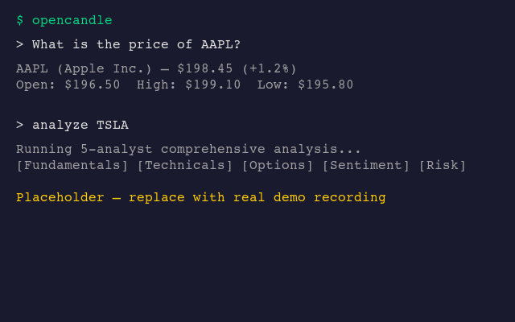
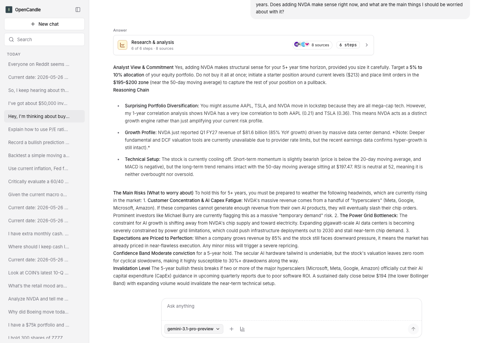

# OpenCandle

OpenCandle is an open source financial investigator built with TypeScript and Pi. Pi is the agent runtime that provides the terminal UI, model auth, session storage, slash commands, and extension hooks. OpenCandle adds finance tools on top: it fetches market, macro, options, fundamentals, filings, sentiment, and portfolio data from real providers, then lets the model synthesize that evidence into an answer.

This repository is useful in three ways:

- Run `opencandle` as an interactive CLI for market research
- Open the local GUI for chat, tool discovery, provider status, and session history
- Extend OpenCandle with new tools, providers, or Pi-compatible add-on packages



## Why OpenCandle?

Financial research gets messy when evidence is scattered across quote pages, filings, macro dashboards, sentiment feeds, and ad hoc spreadsheets. OpenCandle gives the agent explicit tools, provider boundaries, and local state so research stays inspectable: gather the data first, show the gaps, then synthesize without pretending uncertainty disappeared.

OpenCandle is strongest when the answer depends on live or inspectable financial evidence: quotes, histories, options chains, filings, macro series, sentiment, local portfolio state, and source-gap disclosure. Generic agents can still be better for pure finance education or a short conceptual explanation. OpenCandle's job is to make market research auditable.

## What You Can Use It For

- Quote and history lookups for stocks and crypto
- Options chains with locally computed Greeks
- Company fundamentals, earnings, and SEC filings
- FRED macro series and the alternative.me crypto Fear & Greed index
- Reddit-based sentiment and discussion lookups
- Portfolio tracking, watchlists, correlation, and risk analysis
- Multi-step workflows such as `/analyze NVDA`

OpenCandle is designed to fetch and format data. The model handles synthesis. Tool code should not invent financial conclusions or hardcode market numbers.

## Install And Run

Requires Node.js `^20.19.0`, `^22.12.0`, or `>=24.0.0 <27`.

### CLI

```bash
npm install -g opencandle
opencandle

# or without installing globally
npx opencandle@latest
```

### From Source

```bash
npm install
cp .env.example .env
npm start
```

On first run, OpenCandle walks you through model setup. You can rerun that flow later with `/setup`.

For a step-by-step happy path, see [docs/first-run.md](./docs/first-run.md).

## Configuration

Model access comes from Pi. Market data providers are optional and additive. A `.env` file in the current working directory is loaded at startup, and env values override values from `~/.opencandle/config.json`. If the same key is both exported in your shell and present in `.env`, the `.env` value wins.

| Key | Required | Used For |
| --- | --- | --- |
| `GEMINI_API_KEY` | No | Google models through Pi |
| `OPENAI_API_KEY` | No | OpenAI models through Pi |
| `ANTHROPIC_API_KEY` | No | Anthropic models through Pi |
| `ALPHA_VANTAGE_API_KEY` | No | Fundamentals, earnings, financial statements |
| `FRED_API_KEY` | No | Macro series such as rates, CPI, GDP, unemployment |
| `BRAVE_API_KEY` | No | Brave web search fallback |
| `EXA_API_KEY` | No | Exa web search |
| `FINNHUB_API_KEY` | No | Finnhub company news for sentiment summaries |
| `OPENCANDLE_HOME` | No | Override OpenCandle state directory |
| `OPENCANDLE_ROUTER_MODE` | No | `llm` by default; set `rules` for legacy routing |
| `OPENCANDLE_TOOL_SCOPE_MODE` | No | `observe` by default; set `enforce` to apply route-selected active tools |
| `OPENCANDLE_DEBATE` | No | Set `false` or `0` to disable bull/bear debate |
| `OPENCANDLE_GUI_HOST` | No | GUI bind host, default `127.0.0.1` |
| `OPENCANDLE_GUI_PORT` | No | GUI port, default `14567` |

Yahoo Finance, CoinGecko, Reddit, SEC EDGAR, DuckDuckGo search, and the alternative.me crypto Fear & Greed index do not require keys.

OpenCandle stores its own user state in `~/.opencandle/` by default. Pi configuration stays in `.pi/` and `~/.pi/agent/`. The CLI should not depend on repo-local `.pi/extensions/`.

Provider keys can also be stored in `~/.opencandle/config.json`:

```json
{
  "providers": {
    "alphaVantage": {
      "apiKey": "..."
    },
    "fred": {
      "apiKey": "..."
    },
    "brave": {
      "apiKey": "..."
    },
    "exa": {
      "apiKey": "..."
    },
    "finnhub": {
      "apiKey": "..."
    }
  }
}
```

Environment variables override values from `~/.opencandle/config.json`. Set `OPENCANDLE_HOME` if you want OpenCandle state somewhere other than `~/.opencandle/`.

See [docs/configuration.md](./docs/configuration.md) for the full env var, file config, state file, and GUI runtime reference.

## Basic Usage

OpenCandle runs inside Pi's interactive terminal UI. The local GUI can be started with `opencandle gui` from an installed package or `npm run gui` from a checkout.

See [docs/tui.md](./docs/tui.md) for terminal usage, sessions, and slash-command behavior.

Useful commands:

```text
/setup
/login
/model
/connect
/analyze AAPL
```

Example prompts:

```text
What is AAPL trading at?
Get the options chain for TSLA expiring next month
Show me MSFT puts with Greeks
Get the fed funds rate from FRED
Add 100 shares of NVDA at 120 to my portfolio, then show my portfolio
Run risk analysis on SPY
```

## Local GUI

The GUI is a local browser workbench for chat, session history, tool discovery, provider setup, and richer financial result cards.

```bash
opencandle gui
# or from a checkout
npm run gui
```

Then open `http://127.0.0.1:14567`.



The GUI reports whether it is the session `writer` or a read-only `follower` at `/health`. See [docs/gui-quickstart.md](./docs/gui-quickstart.md).

## Data Sources And Tool Coverage

| Area | Examples | Source |
| --- | --- | --- |
| Market data | quotes, history, ticker search, crypto price/history | Yahoo Finance, Alpha Vantage fallback when configured, CoinGecko |
| Options | chains, open interest, IV, Greeks | Yahoo Finance plus local calculations |
| Fundamentals | overview, financials, earnings, DCF, company comparison | Alpha Vantage |
| Macro | economic series, crypto Fear & Greed | FRED, alternative.me |
| Technical | indicators, strategy backtests | Local calculations over market history |
| Sentiment | Reddit, Twitter/X, Finnhub news, and web sentiment with cross-source pipeline | Reddit JSON API, Twitter/X local browser session, Finnhub, Exa, Brave, DuckDuckGo |
| Filings | SEC filing search | SEC EDGAR |
| Portfolio | watchlist, prediction tracking, correlation, risk | Local state plus market data |

## Engineering Notes

### Project Shape

```text
src/
├── providers/    API clients
├── tools/        Tool implementations by domain
├── infra/        Cache, rate limiter, HTTP, browser, paths
├── routing/      Intent classification and slot resolution
├── workflows/    Multi-step workflow builders
├── memory/       SQLite-backed state and retrieval
├── analysts/     Multi-analyst orchestration
├── pi/           Pi integration and session wiring
└── index.ts      Public exports
```

### Development Commands

```bash
npm start
npm run gui
npm run docs:site:build
npm test
npm run test:watch
npm run test:e2e
npm run test:e2e:cli
npm run test:e2e:providers
npm run test:evals
npm run test:evals:product
npm run test:evals:competitive
```

`npm test` is the required baseline check after changes.

The e2e, provider, and eval commands can hit live APIs, live model providers, or local agent CLIs. Run them intentionally; see [docs/testing-and-evals.md](./docs/testing-and-evals.md).

### Repository Rules That Matter

- TDD is mandatory for behavior changes
- Unit tests mock `globalThis.fetch` and use JSON fixtures
- Use `cache` and `rateLimiter` for external calls
- Tools fetch and format data; analysts and prompts synthesize
- Keep typing strict and use `.js` extensions on relative imports

### Public Package Exports

Besides the CLI, the package exposes pieces for engineers building on top of OpenCandle:

- `opencandle`
- `opencandle/tool-kit`
- `opencandle/infra`
- `opencandle/types`
- `opencandle/providers`
- `opencandle/tools`
- `opencandle/workflows`

If you want to add a new tool or publish an add-on package, start with [docs/build-a-tool.md](./docs/build-a-tool.md).

## Testing The Agent

For end-to-end agent driving with file-based IPC:

```bash
npx tsx tests/harness/cli.ts run --prompt "What is AAPL trading at?" --ipc /tmp/opencandle-ipc &
npx tsx tests/harness/cli.ts wait --ipc /tmp/opencandle-ipc
npx tsx tests/harness/cli.ts trace --ipc /tmp/opencandle-ipc
```

The harness writes status and trace files into the IPC directory. See [tests/harness/README.md](./tests/harness/README.md) for the full flow.

## Project Docs

- [docs/index.md](./docs/index.md)
- [docs/getting-started.md](./docs/getting-started.md)
- [docs/first-run.md](./docs/first-run.md)
- [docs/tui.md](./docs/tui.md)
- [docs/investigation-recipes.md](./docs/investigation-recipes.md)
- [docs/data-sources.md](./docs/data-sources.md)
- [docs/configuration.md](./docs/configuration.md)
- [docs/system-architecture.md](./docs/system-architecture.md)
- [docs/gui-quickstart.md](./docs/gui-quickstart.md)
- [docs/testing-and-evals.md](./docs/testing-and-evals.md)
- [docs/benchmarking.md](./docs/benchmarking.md)
- [CONTRIBUTING.md](./CONTRIBUTING.md)
- [docs/build-a-tool.md](./docs/build-a-tool.md)
- [tests/harness/README.md](./tests/harness/README.md)
- [CHANGELOG.md](./CHANGELOG.md)
- [SECURITY.md](./SECURITY.md)
- [LICENSE](./LICENSE)

## Website

The static website lives in [website/](./website/). It builds a product landing page plus the public Markdown docs into `website/dist/`.

```bash
npm run docs:site:build
npm run docs:site:serve
```

GitHub Pages can publish the generated artifact through the included Pages workflow.
