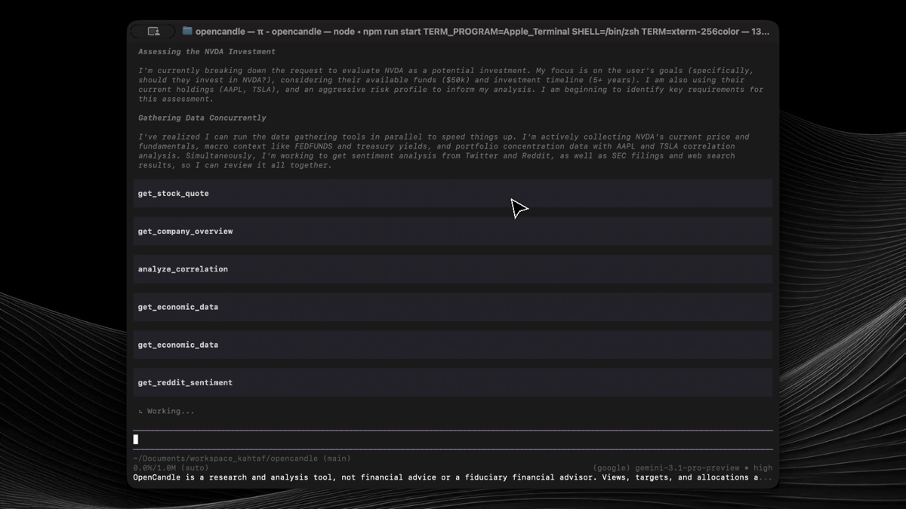
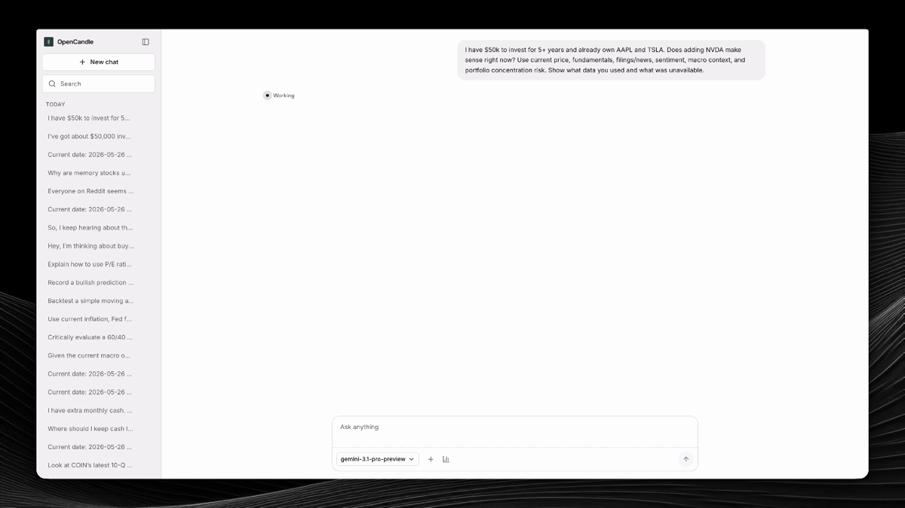

# OpenCandle

```bash
npx opencandle
# or
npx opencandle gui
```

OpenCandle is an open source financial investigator: a terminal agent and local browser workbench for market research that starts from real provider data, shows source gaps, and keeps risk visible.

[Docs](./docs/index.md) | [First run](./docs/first-run.md) | [GUI quickstart](./docs/gui-quickstart.md) | [Data sources](./docs/data-sources.md) | [Build a tool](./docs/build-a-tool.md)

## See It Work

### Terminal UI

[](https://cdn.jsdelivr.net/gh/Kahtaf/OpenCandle@main/assets/opencandle-tui.mp4)

[Watch the terminal UI demo](https://cdn.jsdelivr.net/gh/Kahtaf/OpenCandle@main/assets/opencandle-tui.mp4) | [Download MP4](https://github.com/Kahtaf/OpenCandle/raw/refs/heads/main/assets/opencandle-tui.mp4)

### Local GUI

[](https://cdn.jsdelivr.net/gh/Kahtaf/OpenCandle@main/assets/opencandle-gui.mp4)

[Watch the local GUI demo](https://cdn.jsdelivr.net/gh/Kahtaf/OpenCandle@main/assets/opencandle-gui.mp4) | [Download MP4](https://github.com/Kahtaf/OpenCandle/raw/refs/heads/main/assets/opencandle-gui.mp4)

## Why OpenCandle

Most finance agents answer too early. OpenCandle is built around the opposite loop: understand the question, gather market evidence, disclose missing or stale data, then synthesize.

Use it when a question needs inspectable evidence:

- What is this stock or crypto trading at right now?
- How do two companies compare across price action, fundamentals, filings, and sentiment?
- What does the options chain imply, and where are the Greeks?
- How exposed is my local portfolio or watchlist?
- What macro series, filings, or sentiment sources support the answer?

OpenCandle is read-only research software. It does not place trades, route orders, or provide financial advice.

## Highlights

| Capability | What it gives you |
| --- | --- |
| Terminal agent | Fast keyboard-driven research inside Pi's local TUI, with sessions, slash commands, model setup, and saved transcripts. |
| Local browser GUI | Chat, session history, provider setup, tool discovery, workflow launches, and richer financial result cards at `http://127.0.0.1:14567`. |
| Evidence-first answers | Tools fetch and format data; the model synthesizes only after evidence is gathered. |
| Finance routing | Quote lookup, comparison, portfolio review, options strategy, filing checks, macro questions, sentiment reads, and educational prompts route differently. |
| Provider transparency | Missing keys, degraded sources, stale cache, and unavailable data are surfaced instead of hidden. |
| Local state | OpenCandle user state lives under `~/.opencandle/` unless `OPENCANDLE_HOME` is set; durable market state is stored in SQLite at `state.db`. |
| Extensible tools | TypeScript tool APIs, provider boundaries, workflow builders, and package exports for add-on tools. |
| Eval harness | Unit tests, live provider checks, CLI e2e, GUI browser smoke tests, and competitive finance evals. |

## Quick Start

Requires Node.js `^20.19.0`, `^22.12.0`, or `>=24.0.0 <27`.

```bash
npx opencandle
```

On first run, OpenCandle walks you through model setup. You can use Pi sign-in when available or provide a model API key. Data-provider keys are separate and optional.

Start the GUI instead:

```bash
npx opencandle gui
```

Then open `http://127.0.0.1:14567`.

For a five-minute path from install to a successful answer, see [docs/first-run.md](./docs/first-run.md).

## Example Prompts

```text
/analyze NVDA
What is AAPL trading at?
Compare MSFT and GOOGL using price, fundamentals, and sentiment
Show me TSLA puts with Greeks
Get the fed funds rate from FRED
Add 100 shares of NVDA at 120 to my portfolio, then show my portfolio
Run risk analysis on SPY
```

Useful slash commands:

```text
/setup
/login
/model
/connect
/doctor
/analyze AAPL
```

## Data Sources

| Area | Examples | Source |
| --- | --- | --- |
| Market data | Quotes, history, ticker search, crypto price and history | Yahoo Finance, Alpha Vantage fallback when configured, CoinGecko |
| Options | Chains, open interest, IV, locally computed Greeks | Yahoo Finance plus local calculations |
| Fundamentals | Overview, financials, earnings, DCF, comparable companies | Alpha Vantage |
| Macro | Rates, CPI, GDP, unemployment, crypto Fear & Greed | FRED, alternative.me |
| Technical | Indicators and strategy backtests | Local calculations over market history |
| Sentiment | Reddit, Twitter/X, Finnhub news, and web sentiment | `rdt-cli` and `twitter-cli` using your normal browser sessions, Finnhub, Exa, Brave, DuckDuckGo |
| Filings | SEC filing search | SEC EDGAR |
| Portfolio | Watchlists, holdings, prediction tracking, correlation, risk | Local state plus market data |

Yahoo Finance, CoinGecko, SEC EDGAR, DuckDuckGo search, and the alternative.me crypto Fear & Greed index do not require OpenCandle provider keys. Reddit sentiment requires `rdt-cli` (`uv tool install rdt-cli`) plus an active Reddit session in your normal browser. Twitter/X sentiment requires `twitter-cli` (`uv tool install twitter-cli`) plus an active x.com session in your normal browser. Alpha Vantage, FRED, Brave, Exa, and Finnhub unlock deeper coverage when configured.

## Configuration

Model access comes from Pi. Market data provider keys can be set in the environment, through `/connect`, through the GUI provider setup flow, or in `~/.opencandle/config.json`.

| Key | Used For |
| --- | --- |
| `GEMINI_API_KEY` | Google models through Pi |
| `OPENAI_API_KEY` | OpenAI models through Pi |
| `ANTHROPIC_API_KEY` | Anthropic models through Pi |
| `ALPHA_VANTAGE_API_KEY` | Fundamentals, earnings, financial statements, DCF, comps |
| `FRED_API_KEY` | Macro series such as rates, CPI, GDP, unemployment |
| `BRAVE_API_KEY` | Brave web search fallback |
| `EXA_API_KEY` | Exa web search |
| `FINNHUB_API_KEY` | Finnhub company news for sentiment summaries |
| `OPENCANDLE_HOME` | Override OpenCandle state directory |
| `OPENCANDLE_GUI_HOST` | GUI bind host, default `127.0.0.1` |
| `OPENCANDLE_GUI_PORT` | GUI port, default `14567` |
| `OPENCANDLE_NOTIFICATION_WEBHOOK_URL` | Optional local webhook target for alert/report notification delivery attempts |

Environment variables override `~/.opencandle/config.json`. See [docs/configuration.md](./docs/configuration.md) for the full reference, including advanced routing and diagnostic switches.

## From Source

```bash
git clone https://github.com/Kahtaf/OpenCandle.git
cd OpenCandle
npm install
cp .env.example .env
npm start
```

On Windows Command Prompt, use `copy .env.example .env` instead of `cp .env.example .env`.

Run the local GUI from a checkout:

```bash
npm run gui
```

## How It Fits Together

```text
User prompt
  -> routing and slot resolution
  -> tools and workflows gather provider-backed evidence
  -> provider gaps, stale data, and warnings are preserved
  -> model synthesizes a risk-aware answer
  -> terminal or GUI session records the trace
```

Project shape:

```text
src/
|-- providers/    API clients
|-- tools/        Tool implementations by domain
|-- infra/        Cache, rate limiter, HTTP, browser, paths
|-- routing/      Request understanding, entity extraction, slot resolution
|-- workflows/    WorkflowDefinition builders
|-- runtime/      Session coordinator, workflow runner, runtime context
|-- market-state/ Durable watchlists, portfolios, predictions, alerts, reports
|-- memory/       SQLite-backed state and retrieval
|-- sentiment/    Cross-source sentiment pipeline, scoring, adapters, trends
|-- analysts/     Multi-analyst orchestration
|-- pi/           Pi integration and session wiring
|-- cli.ts        CLI entry point
|-- monitor.ts    Local automation heartbeat command
|-- tool-kit.ts   Public add-on tool helpers
`-- index.ts      Public package exports
```

Package exports:

- `opencandle`
- `opencandle/tool-kit`
- `opencandle/infra`
- `opencandle/types`
- `opencandle/providers`
- `opencandle/tools`
- `opencandle/workflows`

If you want to add a new first-party tool or publish an add-on package, start with [docs/build-a-tool.md](./docs/build-a-tool.md).

## Development

```bash
npm start
npm run gui
npm run docs:site:build
npm test
npm run test:watch
npm run test:e2e
npm run test:e2e:cli
npm run test:e2e:providers
npm run test:evals
npm run test:evals:product
npm run test:evals:competitive
```

Baseline check:

```bash
npm test
```

The e2e, provider, and eval commands can hit live APIs, live model providers, or local agent CLIs. Run them intentionally; see [docs/testing-and-evals.md](./docs/testing-and-evals.md).

Repository rules that matter:

- Unit tests mock `globalThis.fetch` and use fixture JSON.
- External calls go through shared cache and rate-limiter infrastructure.
- Tools fetch and format; analysts and prompts synthesize.
- Relative TypeScript imports use `.js` extensions.
- Behavior changes should be test-first.

For scripted full-session driving with file-based IPC:

```bash
npx tsx tests/harness/cli.ts run --prompt "What is AAPL trading at?" --ipc /tmp/opencandle-ipc &
npx tsx tests/harness/cli.ts wait --ipc /tmp/opencandle-ipc
npx tsx tests/harness/cli.ts trace --ipc /tmp/opencandle-ipc
```

See [tests/harness/README.md](./tests/harness/README.md) for the full flow.

## Documentation

- [Getting Started](./docs/getting-started.md)
- [First Run](./docs/first-run.md)
- [TUI](./docs/tui.md)
- [GUI Quickstart](./docs/gui-quickstart.md)
- [Investigation Recipes](./docs/investigation-recipes.md)
- [Data Sources](./docs/data-sources.md)
- [Configuration](./docs/configuration.md)
- [System Architecture](./docs/system-architecture.md)
- [Testing and Evals](./docs/testing-and-evals.md)
- [Benchmarking](./docs/benchmarking.md)

## License

MIT
