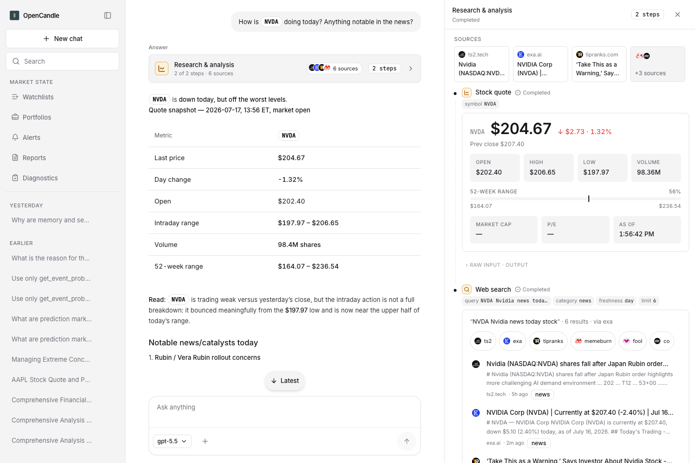
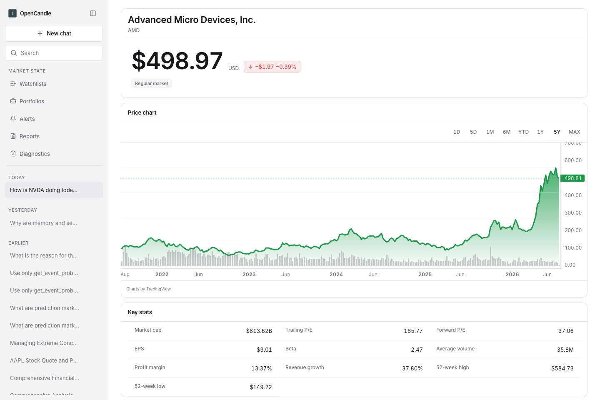
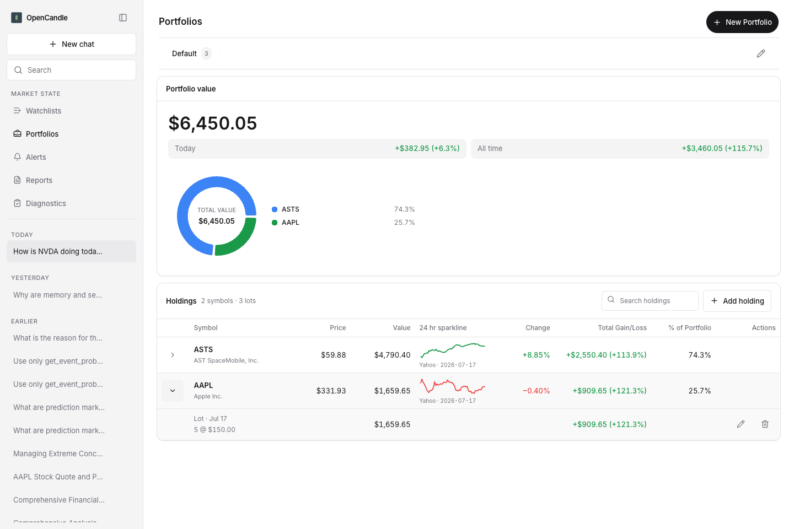

# OpenCandle GUI Quickstart



1. Start the local GUI with `opencandle gui` from an installed package, or `npm install` followed by `npm run gui` from a source checkout.
1. Open `http://127.0.0.1:14567`.
1. If the model setup panel appears, connect a model API key first. Chat cannot run without model access. If you want Pi sign-in instead of an API key, complete terminal `/setup` first and then refresh the GUI.
1. Start with a prompt that needs no API keys, such as `What is AAPL trading at?` or one of the dashboard suggestion cards. When you want deep research, run `/analyze NVDA`; the multi-analyst debate takes a few minutes.
1. Open the catalog with `⌘K` on macOS, `Ctrl+K` on Windows/Linux, or the top-bar catalog button. Use Tools to run a single tool, Workflows to submit a workflow prompt, and Providers to inspect missing credentials.
1. Use the composer plus button to attach images or saved context such as your portfolio, watchlist, or latest report before sending a prompt.

The GUI binds to `127.0.0.1:14567` by default. Override with `OPENCANDLE_GUI_HOST` and `OPENCANDLE_GUI_PORT`; set `OPENCANDLE_GUI_HOST=0.0.0.0` only when you intentionally want LAN or [Tailscale](https://tailscale.com) access.

You can use the GUI and the equally complete terminal interface on the same session at once; OpenCandle keeps them in sync. If a view says it is reconnecting or syncing, wait a moment and retry.

Check that the server is running:

```bash
curl http://127.0.0.1:14567/health
```

`{"ok":true,...}` means the server is running; you can ignore the other fields.

The full local-endpoint list is in [System Architecture](./system-architecture.md#gui-runtime).

## Tailscale Access

For remote viewing, keep the local GUI running and expose it with Tailscale Serve from the machine that is running OpenCandle. Use your own Tailscale node address or hostname:

```bash
tailscale serve --bg http://127.0.0.1:14567
```

Get the shared URL with `tailscale serve status`.

If the page returns `502`, the tunnel is up but the local GUI is not listening. Restart `npm run gui` or `opencandle gui` and verify `curl http://127.0.0.1:14567/health` returns `{"ok":true,...}`.

## Market Dashboard, Symbol Pages, and Charts

The home screen is a market dashboard. Below the composer you get an indices strip (S&P 500, Nasdaq Composite, Dow Jones, Bitcoin) with sparklines, top movers from your watchlists, a portfolio summary with the day's move, and an alerts status card. Sending a prompt starts a fresh chat session.

Every ticker links to a symbol page at `/symbol/<TICKER>`, reachable from watchlist and portfolio rows, ticker popovers in chat, and instrument search. A symbol page shows the live quote with pre-market/after-hours context, an interactive range chart (day through max, with volume, crosshair tooltip, and previous-close line), key stats and fundamentals, plus your saved positions, alerts, and watchlist membership for that symbol.



Charts also appear directly in chat: price-history answers render as interactive chart cards, and comparison prompts render a multi-series chart with each symbol indexed to 100 at the first common date, so relative performance is readable at a glance. Watchlist and portfolio rows carry intraday sparklines with source and freshness context.



Chart and dashboard data is cached locally, so reloading the page or opening a second window stays fast without extra provider calls.

## Investigator Workflow

The GUI is a local investigation workbench. It keeps the transcript, tool catalog, provider setup, session history, and financial context close together so you can see what evidence the agent is using.

- Chat carries the question, tool calls, and synthesis.
- Catalog exposes workflows, individual tools, and provider setup without guessing prompt syntax.
- Session history keeps prior investigations reachable through Pi session state.
- Context and tool result cards make prices, filings, macro data, sentiment, and portfolio facts inspectable.
- Browser and terminal views of the same session stay in sync.

## What You Can Do From The GUI

- Ask a normal finance question, such as `Should I add NVDA if I already own AAPL and TSLA?`
- Launch a workflow from the catalog, such as Comprehensive Analysis, Compare Assets, Portfolio Builder, or Options Screener.
- Run one tool directly when you only need a quote, option chain, filing lookup, or macro series.
- Open a symbol page for any ticker to see its chart, key stats, and your saved positions and alerts in one place.
- Connect provider keys from the Providers tab instead of editing config files.
- Inspect tool cards and their details to see arguments, results, sources, and warnings.
- Reopen previous sessions and continue the investigation.
- Answer focused follow-up questions when OpenCandle needs a ticker, goal, horizon, budget, or risk preference before proceeding.

Workflow catalog entries prefill a structured chat prompt. They do not switch the GUI into a separate mode; the result still appears in the same chat timeline with the same tool cards and session history.

Data-quality warnings and provider gaps are available on the Diagnostics page.

## When To Use The GUI

Use the GUI as the primary OpenCandle workspace: inspect tool output visually, browse prior sessions, run an individual tool from the catalog, and manage provider setup without remembering command syntax.

Prefer a keyboard-first workflow? The TUI is an equally complete path through the same tools, workflows, evidence, and saved state, with slash commands and a plain terminal transcript. See [Terminal (TUI)](./tui.md).

For GUI internals, see [System Architecture](./system-architecture.md). For GUI validation, see [Testing and Evals](./testing-and-evals.md).
