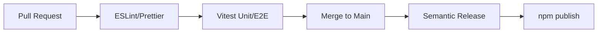

# Vantage: Productionization Plan

## 1. Overview & Vision
The goal is to evolve Vantage from a local script (`tsx src/index.ts`) into a globally distributable CLI/TUI application that users can install via `npm install -g vantage-agent`. It will feature a rich Text User Interface (TUI), automated CI/CD for reliable releases, and comprehensive documentation for both end-users and contributors.

---

## 2. Distribution Strategy (npm)

To make the agent easily installable by anyone with Node.js:

1. **Bundling**: Introduce a bundler like `tsup` or `esbuild`. This compiles the TypeScript codebase into a fast, standalone ES Module (ESM) bundle, minimizing installation time and resolving import issues.
2. **Binary Wrapper**: Update `package.json` with a `bin` entry:
   ```json
   "bin": {
     "vantage": "./dist/cli.js"
   }
   ```
3. **Configuration Management**: Move away from relying solely on local `.env` files. Implement a global configuration system (e.g., using `conf` or `env-paths`) to store API keys securely in `~/.vantage/config.json` or `~/.config/vantage/`.

---

## 3. User Interface: The TUI (Text User Interface)

Since Vantage is heavily based on `pi-agent`, giving users visibility into the agent's "thought process" and tool execution is critical for trust and UX. 

**Recommendation:** Build a TUI using **Ink** (React for interactive CLIs) or **Clack** (for beautiful, linear CLI prompts).
**Core TUI Features:**
- **Streaming Responses**: Render the LLM's streaming output with real-time markdown parsing.
- **Thought / Status Indicators**: Spinners showing active tool executions (e.g., `⠋ Fetching TSLA option chain...`, `⠙ Running Black-Scholes local computation...`).
- **Configuration Flow**: An interactive first-run wizard prompting the user for their `GEMINI_API_KEY`, `ALPHA_VANTAGE_API_KEY`, etc.
- **Error Boundaries**: Graceful, readable error handling if rate limits (e.g., Yahoo Finance) are hit or Camoufox stealth sessions fail.

---

## 4. CI/CD Pipeline (GitHub Actions)

A robust pipeline ensures code quality and automates releases.



### 4.1. Pull Request Checks (The Quality Gate)
- **Linting & Formatting**: Enforce strict TypeScript checks, ESLint, and Prettier formatting.
- **Automated Testing**: Run `npm test` via Vitest. As per the project's strict conventions, **Red/Green TDD is mandatory**. The pipeline will fail if coverage drops or if tests fail. Live API calls are strictly mocked via `tests/fixtures/`.

### 4.2. Automated Releases
- Implement **Semantic Release** or **Changesets**.
- When a PR is merged into `main`, GitHub Actions will:
  1. Determine the next semantic version number based on commit messages (e.g., `feat:`, `fix:`).
  2. Generate an automated `CHANGELOG.md`.
  3. Build the project via `tsup`.
  4. Publish the package directly to the npm registry.

---

## 5. Documentation Strategy

To ensure adoption and easy onboarding:

1. **`README.md` (User-Facing)**
   - **Quickstart**: `npm install -g vantage-agent && vantage`
   - **Configuration**: How to add API keys via the CLI wizard.
   - **Features & Examples**: Demonstrating the financial, macro, and sentiment capabilities.
2. **`CONTRIBUTING.md` (Developer-Facing)**
   - Clear instructions on the architecture (tools vs providers vs analysts).
   - Strict outline of the **TDD MANDATORY** policy.
   - Guide on how to add a new tool or provider and create the corresponding mock fixtures.
3. **`ARCHITECTURE.md` / Diagrams**
   - Detailed diagrams showing the flow between the user, Gemini API, `pi-agent-core` loop, local computation modules, and stealth browser fallback (`camoufox-js`).

---

## 6. Execution Phases

| Phase | Milestone | Description |
|-------|-----------|-------------|
| **Phase 1** | CLI & Config | Build the global config manager (key storage) and basic CLI entry point. Setup `tsup` build process. |
| **Phase 2** | TUI Integration | Integrate Ink/Clack. Add spinners, streaming markdown rendering, and interactive setup. |
| **Phase 3** | CI/CD | Add GitHub Actions for linting, strict Vitest execution, and Semantic Release automation. |
| **Phase 4** | Documentation | Finalize README, CONTRIBUTING, and release v1.0.0 to npm. |