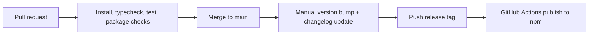

# Vantage OSS Launch Plan

## 1. Purpose

This document is the canonical plan for taking Vantage from a local development project to a public npm package with a credible open source maintenance baseline.

The goal is not just "make it publish." The goal is to make the package installable, understandable, supportable, and safe to adopt:

- Public npm package: `@kahtaf/vantage`
- User-facing executable: `vantage`
- Supported install mode: global npm install
- Pi-owned config remains in `~/.pi/agent/...`
- Vantage-owned state remains in `~/.vantage/`

Vantage should follow Pi's minimal CLI-first posture where possible: keep the runtime surface small, keep the config model explicit, and avoid process overhead that does not help the first public release.

## 2. Current State and Gaps

### 2.1. What already exists

- A working TypeScript codebase with Vitest coverage and mocked provider fixtures
- A user-facing [README](/Users/kahtaf/.codex/worktrees/dc41/vantage/README.md)
- A clear runtime-state separation between Pi config and Vantage-owned data
- A draft production plan focused on packaging/TUI/CI concerns

### 2.2. Current OSS hygiene gaps

The repository currently has only `README.md` and `.gitignore` as top-level OSS-facing hygiene files.

Missing launch-baseline artifacts:

- `LICENSE`
- `CONTRIBUTING.md`
- `CODE_OF_CONDUCT.md`
- `SECURITY.md`
- GitHub issue forms for bugs and feature requests
- GitHub pull request template

Current npm tarball hygiene also fails the target public-release bar. A dry run currently includes repository docs, tests, fixtures, and internal project files. Public release must ship a dist-focused tarball plus standard metadata files, not the full source repository by default.

## 3. Public npm Contract

This section defines the package contract the repository must support before the first public npm release.

### 3.1. Package identity

- Package name: `@kahtaf/vantage`
- Executable: `vantage`
- Install command: `npm install -g @kahtaf/vantage`
- Update command: `npm install -g @kahtaf/vantage@latest`

### 3.2. Runtime and state boundaries

- Pi manages model/auth configuration in `~/.pi/agent/...`
- Vantage manages finance-provider config and user state in `~/.vantage/`
- The published CLI must work from any directory
- The published CLI must not depend on a repo-local `.pi/extensions/...` path

### 3.3. Runtime support target

- Node.js `>=20`
- Validate against active LTS lines in CI before public release

### 3.4. Versioning policy

- Stay pre-1.0 until the npm package contract and CLI behavior are stable
- Every user-visible release must have a generated changelog entry
- Release notes must be readable without opening the diff

## 4. OSS Hygiene Baseline

The following repository artifacts are required before launch.

| File | Purpose | Launch requirement |
|------|---------|--------------------|
| `LICENSE` | Legal reuse terms | MIT |
| `CONTRIBUTING.md` | Contributor workflow and quality bar | Required |
| `CODE_OF_CONDUCT.md` | Collaboration expectations and reporting path | Required |
| `SECURITY.md` | Vulnerability reporting and supported versions | Required |
| `.github/ISSUE_TEMPLATE/bug-report.yml` | Repro-friendly bug intake | Required |
| `.github/ISSUE_TEMPLATE/feature-request.yml` | Scope-first feature intake | Required |
| `.github/pull_request_template.md` | Standardize PR context and validation | Required |

### 4.1. Maintainer policy

Use a lightweight but explicit maintainer bar modeled after projects like Pi and Vitest:

- Non-trivial features should start with an issue or discussion before implementation
- Behavior-changing PRs must include tests
- Bug reports should require reproduction detail
- PRs should explain user impact, risk, and validation
- Commit and release note conventions must stay structured enough to generate useful changelogs

### 4.2. Support surface

For v1, keep support intentionally narrow:

- Public support surface: GitHub Issues
- Private security reporting surface: GitHub Security Advisories / private vulnerability reporting
- No required Discord, Discussions board, or separate support queue for the first public release

## 5. Documentation Matrix

The minimum doc set should be split by audience.

| Document | Audience | Required content |
|----------|----------|------------------|
| [README.md](/Users/kahtaf/.codex/worktrees/dc41/vantage/README.md) | Users | Install, first run, config, supported providers, common commands, architecture summary |
| [CONTRIBUTING.md](/Users/kahtaf/.codex/worktrees/dc41/vantage/CONTRIBUTING.md) | Contributors | Local setup, test commands, TDD rule, fixture-first provider testing, PR expectations |
| [SECURITY.md](/Users/kahtaf/.codex/worktrees/dc41/vantage/SECURITY.md) | Users and maintainers | Supported versions and private reporting path |
| [docs/production-plan.md](/Users/kahtaf/.codex/worktrees/dc41/vantage/docs/production-plan.md) | Maintainers | Release policy, launch checklist, CI/CD, npm distribution contract |

Documentation should stay factual about current behavior. The release plan can define future packaging work, but user-facing docs should not claim public npm availability until the package is actually published.

## 6. npm Packaging and Tarball Hygiene

Public release requires an explicit packaging policy.

### 6.1. Required package metadata

Before publishing, `package.json` must define:

- `name`
- `bin`
- `files` allowlist or `.npmignore`
- `engines`
- `repository`
- `homepage`
- `bugs`
- `keywords`
- `license`

### 6.2. Publish footprint

Release tarballs should include:

- Built CLI/runtime artifacts under `dist/`
- Required package metadata
- User-facing docs that materially help package consumers, if intentionally included

Release tarballs should not include by default:

- `tests/`
- `docs/` planning material
- internal fixtures
- local-only repo support files
- source files that are not required for runtime or intended source distribution

### 6.3. Release blocker

`npm pack --dry-run` is a hard gate for launch.

The dry-run output must show a dist-focused footprint that matches the intended public package. If docs, tests, fixtures, or internal repo files are still present, release work is not complete.

## 7. CI/CD and Release Policy

### 7.1. Pull request quality gate

Every PR to `main` should pass:

- install
- typecheck
- `npm test`
- packaging validation where applicable

Behavior-changing work should fail review if it does not include matching tests.

### 7.2. Release mechanism

Use a hybrid release flow:

- `npm run version:patch|minor|major` for semver bumps
- a committed `CHANGELOG.md` with a top-level `Unreleased` section
- `npm run release:patch|minor|major` for the maintainer preparation flow
- GitHub Actions publish from pushed `v*` tags using npm trusted publishing

For Vantage, this is simpler than Changesets because the repo currently publishes a single package, not a multi-package workspace.

### 7.3. Publish pipeline

The target release flow is:

### 7.4. Supply-chain policy

- Keep Pi-style local versioning and changelog handling while the project remains a single package
- Run release commands from a clean working tree only
- Publish to npm from GitHub Actions via trusted publishing instead of a maintainer laptop
- Enable npm provenance on tagged releases

## 8. Launch Phases

### Phase 1. OSS baseline docs and repo metadata

Deliverables:

- `LICENSE`
- `CONTRIBUTING.md`
- `CODE_OF_CONDUCT.md`
- `SECURITY.md`
- GitHub issue forms
- PR template

Exit criteria:

- A new contributor can discover project norms without reading source files first
- The repo has a clear public support path and private security path

### Phase 2. npm packaging contract and tarball cleanup

Deliverables:

- scoped npm package identity
- `bin` entry
- packaging allowlist
- runtime support metadata
- dist-focused tarball

Exit criteria:

- `npm pack --dry-run` includes only the intended publish footprint
- Global install and update flow are documented and technically valid

### Phase 3. CI/release automation and trusted publishing

Deliverables:

- GitHub Actions quality gate
- Pi-style version and release scripts
- tag-triggered npm publish workflow
- trusted publishing and provenance

Exit criteria:

- A maintainer can run the documented release commands without manual version file editing, and a pushed release tag publishes from GitHub Actions

### Phase 4. Launch validation and first public release

Deliverables:

- launch checklist execution
- install/update validation
- doc review against actual behavior
- first public npm release

Exit criteria:

- A fresh machine can install and run `vantage`
- Update instructions work as documented
- User-facing docs match the published package behavior

## 9. Acceptance Checks

The launch is not complete until all of the following pass:

1. `npm pack --dry-run` includes only the built CLI/runtime artifacts and standard metadata files.
2. A fresh machine can install globally, run `vantage --help`, complete first-run setup, and update via npm without a repo-local `.pi/extensions/...`.
3. [README.md](/Users/kahtaf/.codex/worktrees/dc41/vantage/README.md) accurately describes the real config and state split between `~/.pi/agent` and `~/.vantage/`.
4. A contributor can follow [CONTRIBUTING.md](/Users/kahtaf/.codex/worktrees/dc41/vantage/CONTRIBUTING.md), run `npm test`, and understand the test/fixture workflow without tribal knowledge.
5. The documented release flow can generate a changelog, publish from a GitHub Actions tag workflow, and leave the changelog reset with a fresh `Unreleased` section.

## 10. Reference Inspiration

- Pi mono for CLI-first install/update posture and contributor entry points: [github.com/badlogic/pi-mono](https://github.com/badlogic/pi-mono)
- Vitest for contributor discipline and test-first contribution norms: [CONTRIBUTING.md](https://raw.githubusercontent.com/vitest-dev/vitest/main/CONTRIBUTING.md)
- pnpm for concise security policy structure: [SECURITY.md](https://raw.githubusercontent.com/pnpm/pnpm/main/SECURITY.md)
- React for a direct vulnerability reporting policy: [SECURITY.md](https://raw.githubusercontent.com/facebook/react/main/SECURITY.md)
- npm docs for package publishing details if the release flow is hardened later:
  - [Trusted publishers](https://docs.npmjs.com/trusted-publishers/)
  - [Generating provenance statements](https://docs.npmjs.com/generating-provenance-statements/)
